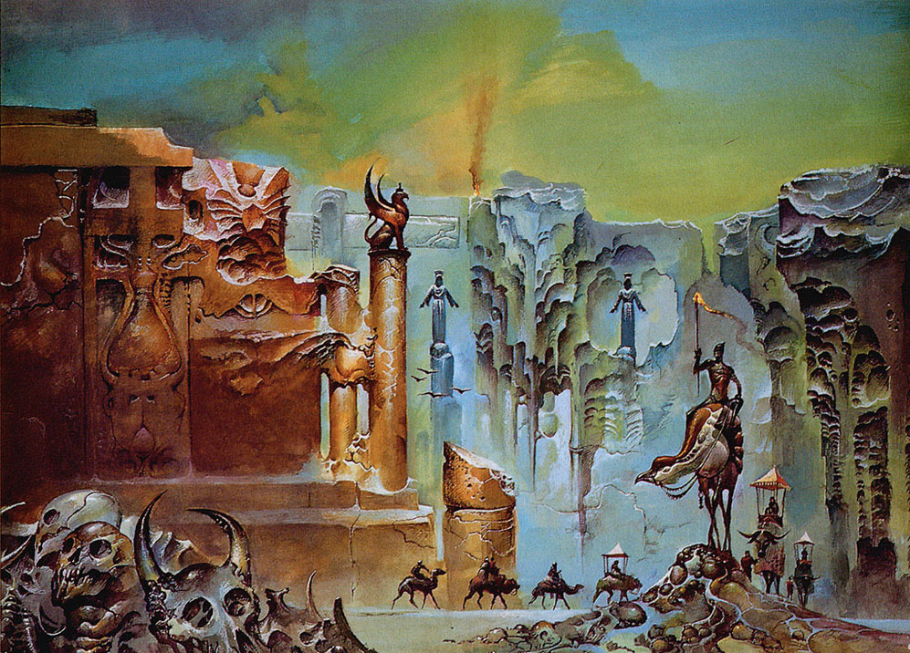

# Avern Engine

Opinionated framework for 3d role-playing games in the browser. If it is somewhere in between Dark Souls and Trails in the Sky you can make it with the Avern Engine.

Live demo [here](https://avern-frontend.vercel.app/)

## Features
- Entity Component System framework
- Player, NonPlayer, Interface and World components for rapid prototyping
- Pathfinding and collision systems
- Signal based communication between gameObjects based on the Observer design pattern
- Content management and asset storage via Sanity
- Load a base GLTF constructed in Blender or start from scratch
- Publish as a website or make it available on itch.io inside an iframe